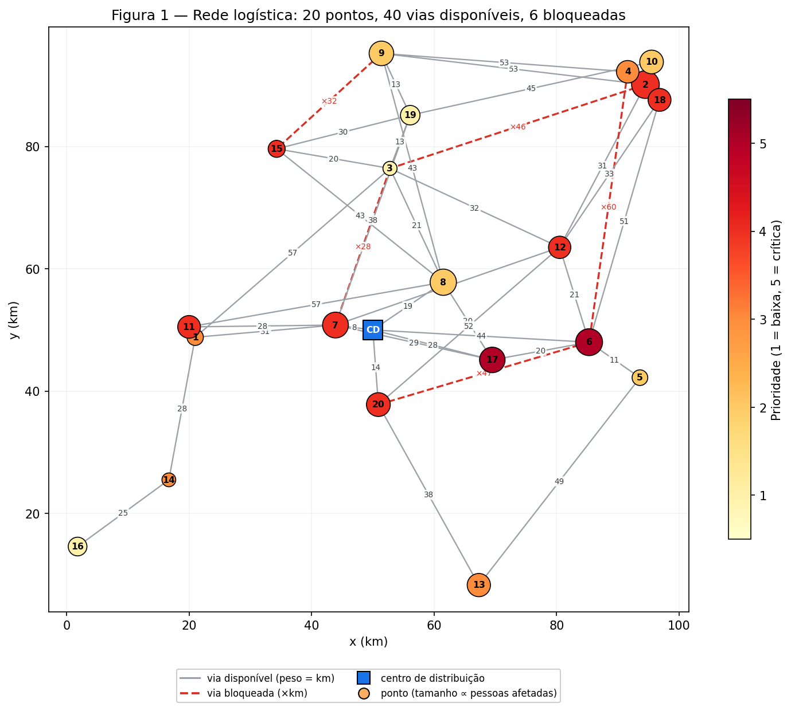
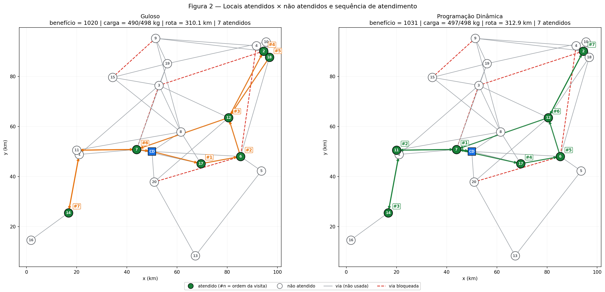
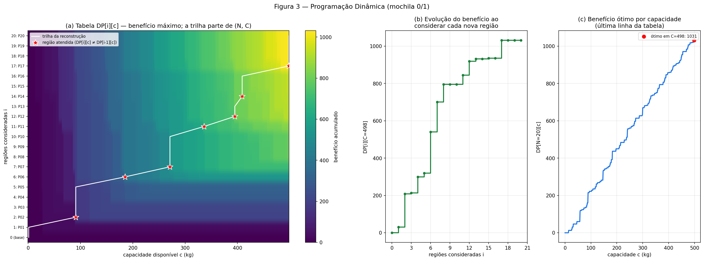
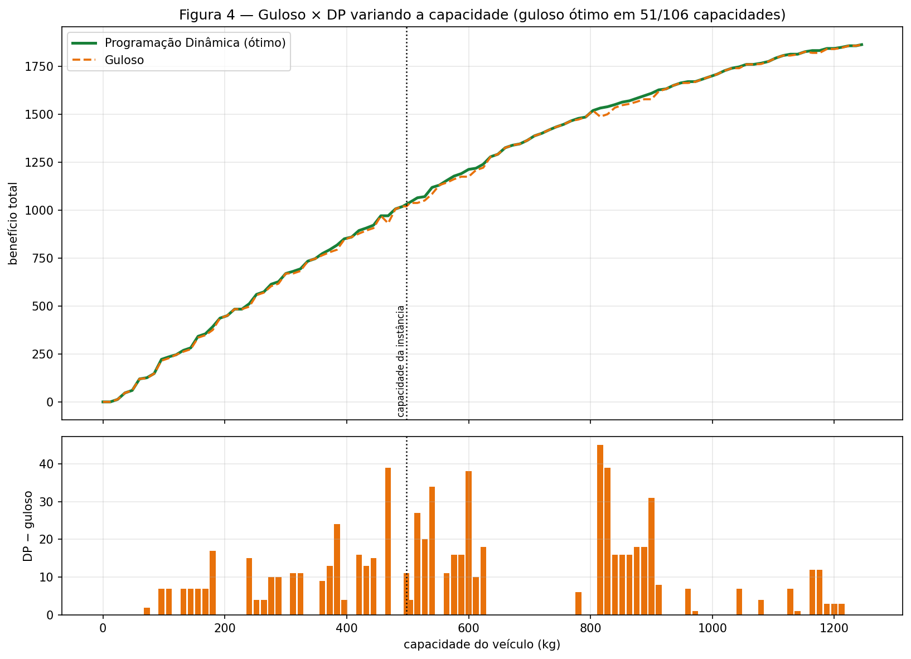
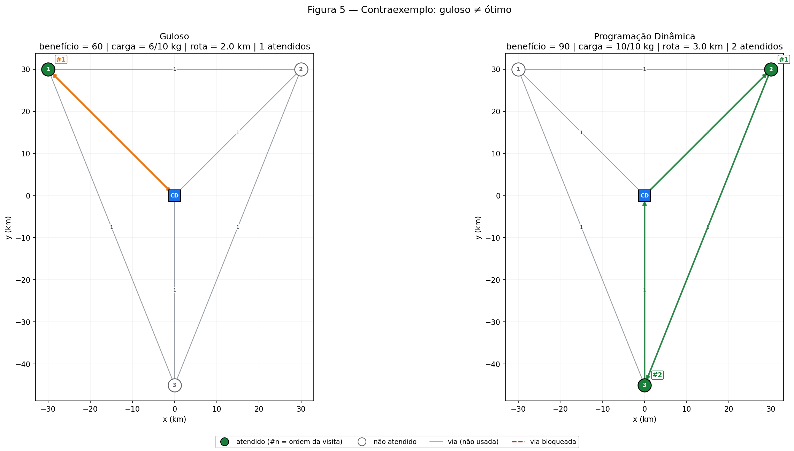
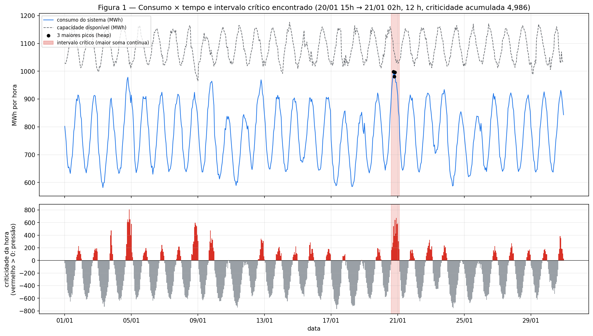
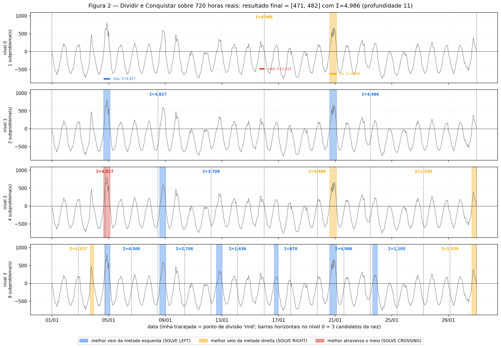
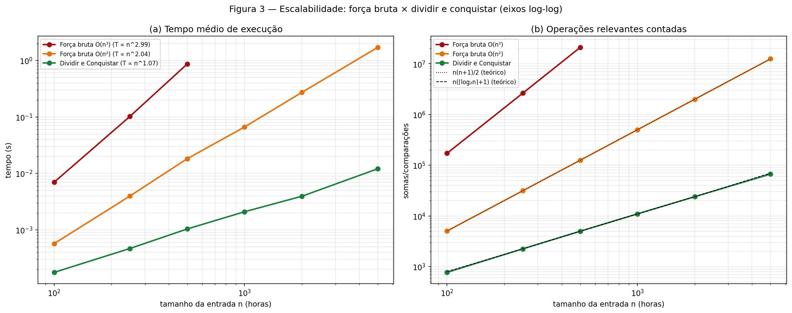
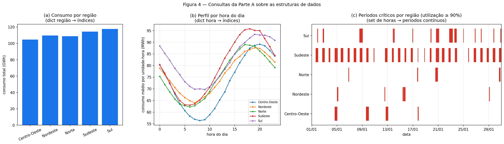

# Checkpoint 4 — Algoritmos e Estruturas de Dados (Turma W)

## Integrantes

| Nome completo | RA |
|---|---|
| Nicolas Barnabe da Cruz | 561997 |
| Luiz Antônio Moraes Santos | 562142 |
| Kevin Carvalho Venâncio | 561459 |
| Guilherme de Melo Sorrilha | 563825 |
| Yan Breno Barutti Conceição | 566412 |

**SEED do grupo:** `1` (constante `SEED_GRUPO` em `src/config.py`; **troque pelo número do seu grupo** e reexecute `python run_questao1.py` e `python run_questao2.py`). O mesmo SEED alimenta as duas questões.
Mesma seed ⇒ mesmos dados; seeds diferentes ⇒ instâncias diferentes.

---

## Questão 1 — Logística de emergência após eventos climáticos

### 1. Problema

Uma equipe da Defesa Civil parte de um centro de distribuição (CD) com **um veículo de capacidade limitada** e precisa decidir *quais* pontos de atendimento
(afetados por chuvas/enchentes) atender e em *que ordem*, maximizando o benefício total, sabendo que algumas vias estão bloqueadas.

### 2. Modelo adotado

* **Grafo ponderado não direcionado:** vértice 0 = CD; vértices 1..20 = pontos de atendimento; peso = distância (km).
* **Dados (seed 1):** 20 pontos, 46 vias (40 disponíveis + 6 **bloqueadas**), grafo **não completo** (46 de 210 pares possíveis).
* **Por ponto:** pessoas afetadas, prioridade (1–5), demanda mínima de 5 recursos (água, medicamentos, alimentos, higiene, cobertores) convertida em **carga (kg)** e **benefício esperado** (∝ pessoas × prioridade).
* **Veículo:** capacidade de **498 kg** (40% da carga total de 1245 kg).
* **Regiões candidatas:** pontos alcançáveis a partir do CD usando somente vias disponíveis (BFS).
* **Atendimento indivisível:** ou se entrega toda a demanda mínima do ponto ou nada ⇒ *mochila 0/1*.
* Arquivos: `data/problema1.csv` (pontos), `data/problema1_arestas.csv` (vias, `disponivel = 0` ⇒ bloqueada), `data/problema1_meta.json` (seed e capacidade).

### 3. Estruturas de dados (por quê)

| Estrutura | Onde | Justificativa (operação) |
|---|---|---|
| `dict` de `dict` (lista de adjacência) | grafo | grafo esparso (E ≪ V²): vizinhos em O(grau), peso em O(1); a matriz gastaria O(V²) |
| `heapq` (min-heap) | Dijkstra | extrair o vértice mais próximo em O(log V) em vez de O(V) |
| `set` | vias bloqueadas, pendentes do guloso | pertinência O(1) e sem duplicatas |
| `tuple` | chave da aresta `(min,max)`, demanda do ponto | imutável/hashable; `(u,v)` e `(v,u)` viram a mesma via |
| `deque` | BFS | `popleft` O(1) (`list.pop(0)` é O(n)) |
| `list[list[int]]` | tabela DP | acesso O(1) por `[i][c]` e reconstrução por varredura reversa |
| `dict` (cache) | `TabelaDistancias` | cada Dijkstra é calculado uma única vez por origem |

### 4. Algoritmos

* **Dijkstra** (implementado por nós, `src/grafos.py`): distâncias e caminhos mínimos só por vias disponíveis.
* **Guloso** (`src/greedy.py`): a cada passo escolhe, entre os pontos que ainda cabem, o de maior
  `score = benefício / (carga + λ·distância)` (λ = 0,5). É o "benefício por unidade de custo": para itens divisíveis e λ = 0 é a mochila fracionária, na qual a maior razão é comprovadamente ótima (argumento de troca).
  Como os atendimentos são indivisíveis, deixa de ser ótimo — ver contraexemplo.
* **Programação dinâmica** (`src/dynamic_programming.py`): `DP[i][c]` = maior benefício com as `i` primeiras regiões e `c` kg.
  Decisão: atender ou não a região `i`. Base: `DP[0][c] = 0`. Recorrência: `DP[i][c] = max(DP[i-1][c], DP[i-1][c-w_i] + b_i)` (se `w_i ≤ c`; senão `DP[i-1][c]`).
  Reconstrução: de `(N, C)` para cima, se `DP[i][c] ≠ DP[i-1][c]` a região `i` foi atendida e `c ← c − w_i`.
* **Ordem da visita** do conjunto escolhido pela DP: vizinho mais próximo (o problema exato é um TSP, NP-difícil).

### 5. Como executar

```bash
python -m venv .venv && source .venv/bin/activate      # Windows: .venv\Scripts\activate
pip install -r requirements.txt
python run_questao1.py                # gera data/, figures/questao1/ e docs/resultados_questao1.txt
python run_questao1.py --seed 7       # outra instância
pytest -q                             # testes (Q1 e Q2)
jupyter notebook notebooks/questao1.ipynb
```

### 6. Resultados (seed 1)

| Método | Benefício | Carga usada | Rota (km) | Atendidos |
|---|---|---|---|---|
| Guloso | 1020 | 490 / 498 kg | 310,1 | 7 |
| **Programação Dinâmica** | **1031** | 497 / 498 kg | 312,9 | 7 |

* **Varredura de capacidade (0 a 1245 kg):** guloso ótimo em 51 de 106 capacidades (inclusive nos extremos, onde nada cabe ou tudo cabe); a DP é superior nas demais (maior diferença: 45).
* **200 instâncias sorteadas (seeds 1–200):** guloso ótimo em 46 (23%); perda média 2,1%; pior caso 10,6% (seed 148).
* **Contraexemplo próprio (guloso ≠ ótimo):** capacidade 10 kg; A (6 kg, benefício 60), B (5 kg, 45), C (5 kg, 45). O guloso escolhe A (maior razão) e sobra 4 kg inútil: **60**. O ótimo é B + C = **90**. O guloso é ótimo para a relaxação fracionária (limite 96), mas o item de maior razão fragmenta a capacidade.

Figuras (geradas pelo código, em `figures/questao1/`):

| | |
|---|---|
| Figura 1 — grafo (CD, pontos, pesos, vias bloqueadas) |  |
| Figura 2 — locais atendidos/não atendidos e sequência |  |
| Figura 3 — DP: heatmap, reconstrução, evolução |  |
| Figura 4 — guloso × DP por capacidade |  |
| Figura 5 — contraexemplo |  |

### 7. Complexidade

`V` vértices, `E` arestas disponíveis, `N` candidatas, `K` atendidas, `C` capacidade (detalhes e derivações em [`docs/analise_complexidade.md`](docs/analise_complexidade.md)).

* **Dijkstra:** `O(E log V)` tempo, `O(V+E)` espaço — no máximo `2E` inserções no heap, cada uma `O(log V)`.
* **Guloso:** `O(N²)` nas decisões (≤ N passos × varredura de ≤ N pendentes) + `O(K·E log V)` dos Dijkstra por posição visitada.
* **DP:** `Θ(N·C)` tempo (N·(C+1) células, `O(1)` cada); `Θ(N·C)` espaço com tabela completa, `Θ(C)` só para o valor. Pseudopolinomial.
* **Pipeline:** `O(K·E log V + N·C)`.

### 8. Limitações

* A DP escolhe o *conjunto* ótimo, mas a **rota** é heurística (vizinho mais próximo); a distância total não é minimizada.
* Um único veículo e uma única viagem (sem múltiplos veículos, janelas de tempo ou reabastecimento).
* Benefício e carga são **sintéticos** (fórmulas do gerador), não dados reais da Defesa Civil.
* A DP é pseudopolinomial: `C` em gramas tornaria a tabela ~1000× maior.
* O score guloso depende de λ (escolhido pelo grupo, não calibrado com dados reais).
* Não há cache automático: se o grafo for alterado depois de criar uma `TabelaDistancias`, é preciso criar outra.

---

## Questão 2 — Gestão inteligente do consumo de energia

### 1. Problema

Dadas medições horárias de consumo de energia de várias unidades em cinco regiões, achar o **intervalo contínuo de tempo com maior condição crítica acumulada** e responder a consultas sobre os dados
(consumo por região, por horário, picos, períodos críticos, seleção de intervalos). Comparar **força bruta** e **dividir e conquistar** e relacionar tempo medido com análise assintótica.

### 2. Modelo adotado

* **Dados sintéticos, reprodutíveis e documentados** (`src/gerador_q2.py`, `random.Random(SEED)`): 5 regiões × 2 unidades × 720 horas (30 dias a partir de 01/01/2026) = **7 200 registros** em `data/problema2.csv`
  (`timestamp, regiao, unidade, consumo_mwh, capacidade_mwh, prioridade, custo_rs_mwh`; seed e parâmetros em `data/problema2_meta.json`).
  Consumo = capacidade-base × uso médio × perfil diário (pico 18–20 h) × fim de semana × ondas de calor (+20–45%, 6–30 h) × ruído; capacidade = base × variação solar × indisponibilidades (−10–25%, 4–12 h); custo sobe com a utilização.
* **Função de criticidade** de um registro (`u = consumo/capacidade`): `prioridade · [100(u − 0,80) + 3·100·max(0, u − 1)] + 10(custo/300 − 1)`, em inteiros (escala 1/100).
  Tem **sinal**: folga (u < 0,80) é negativa. Sem isso, o maior intervalo acumulado seria sempre a série inteira e o problema perderia sentido.
* **Série de entrada dos algoritmos:** criticidade horária do sistema = soma das unidades em cada hora (n = 720).
* **Desempate** (igual nos três algoritmos): maior soma, depois intervalo mais curto, depois o que começa mais cedo.

### 3. Estruturas de dados (mínimo exigido: 4; usamos 7)

| Estrutura | Operação em que oferece vantagem | Custo |
|---|---|---|
| `list` ordenada por tempo | acesso por posição e fatias contíguas (intervalo de tempo = índices contíguos) | O(1) / O(k) |
| `bisect` sobre `list` de timestamps | selecionar `[t0, t1]` por data | O(log n) |
| `list` de somas prefixo | soma de criticidade de qualquer intervalo | O(1) |
| `dict` região → índices; `dict` hora do dia → índices | consumo por região / por horário sem varrer os demais registros | O(1) + O(k) |
| `tuple` (`NamedTuple` `Registro`) | registro imutável e *hashable* | O(1) |
| `set` de horas críticas | pertinência e **interseção** entre regiões | O(1) / O(min(a,b)) |
| `heapq` (min-heap de tamanho k) | k maiores picos sem ordenar tudo | O(n log k) |

### 4. Algoritmos

* **Força bruta** (`src/brute_force.py`): examina explicitamente os n(n+1)/2 intervalos `[i, j]`. Versão cúbica (soma cada trecho do zero, Θ(n³)) e quadrática (soma corrente, Θ(n²)).
* **Dividir e conquistar** (`src/divide_conquer.py`): DIVIDE (`mid`) → SOLVE LEFT → SOLVE RIGHT → SOLVE CROSSING → COMBINE.
  Caso-base: 1 elemento. Caso cruzado: melhor **sufixo** da metade esquerda + melhor **prefixo** da direita, em O(tamanho) — as duas escolhas são independentes.
  Os três casos (esquerda, direita, cruzado) são exaustivos, então o melhor dos três é ótimo. `T(n) = 2T(n/2) + Θ(n) = Θ(n log n)`.
* **Experimento de escalabilidade** (`src/escalabilidade.py`): n ∈ {100, 250, 500, 1000, 2000, 5000}; tempo médio, operações contadas e pico de memória (`tracemalloc`).

### 5. Como executar

```bash
python run_questao2.py            # ≈ 1,5 min (gera data/, figures/questao2/ e docs/resultados_questao2.txt)
python run_questao2.py --rapido   # poucos segundos (sem n = 2000/5000 e sem o teste de 1.000.000)
pytest -q                         # testes das duas questões
jupyter notebook notebooks/questao2.ipynb
```

### 6. Resultados (seed 1)

* **Intervalo crítico:** 20/01 15h → 21/01 02h (12 horas), criticidade acumulada **4 986**. Força bruta cúbica, quadrática e D&C retornam exatamente o mesmo intervalo.
* Na raiz do D&C: melhor da esquerda Σ = 4 827; melhor da direita Σ = 4 986; cruzando o meio Σ = 1 211.
* **Escalabilidade** (tempos de uma execução típica; variam com a máquina):

| n | Força bruta O(n³) | Força bruta O(n²) | Dividir e Conquistar | operações O(n²) / D&C |
|---|---|---|---|---|
| 100 | 8 ms | 0,7 ms | 0,2 ms | 5 050 / 772 |
| 500 | ≈ 0,8 s | 16 ms | 1,1 ms | 125 250 / 4 988 |
| 1 000 | — | 64 ms | 2,2 ms | 500 500 / 10 976 |
| 5 000 | — | ≈ 1,8 s | ≈ 11 ms | 12 502 500 / 66 808 |

  Expoentes (regressão log-log): ≈ 2,9 (cúbica), ≈ 2,0 (quadrática), ≈ 1,0 (D&C). Dobrar n multiplica a quadrática por ≈ 4 e o D&C por ≈ 2.
* **1.000.000 de registros:** D&C medido em ≈ 2,7 s (2,1·10⁷ operações, 21 níveis de recursão); força bruta O(n²) ≈ 19 h (5·10¹¹ somas, extrapolado do tempo em n = 5 000). Só o D&C é viável.

| | |
|---|---|
| Figura 1 — consumo × tempo e intervalo crítico |  |
| Figura 2 — 4 níveis da decomposição (dados reais) |  |
| Figura 3 — escalabilidade (log-log) |  |
| Figura 4 — consultas da Parte A |  |

### 7. Complexidade

`n` horas, `R` registros (`R = 10n`). Derivações completas em [`docs/analise_complexidade.md`](docs/analise_complexidade.md).

| Algoritmo | Tempo | Espaço | Origem |
|---|---|---|---|
| Força bruta cúbica | Θ(n³) = n(n+1)(n+2)/6 | O(1) | 3 laços: início, fim, soma do trecho |
| Força bruta quadrática | Θ(n²) = n(n+1)/2 | O(1) | 2 laços; soma corrente |
| Dividir e conquistar | Θ(n log n) | O(log n) | n por nível × ⌈log₂ n⌉+1 níveis; pilha de profundidade log n, sem fatias |

### 8. Limitações

* Dados **sintéticos**: os padrões (pico noturno, ondas de calor) são hipóteses do gerador, não medições do sistema elétrico brasileiro.
* A escolha da criticidade (U_REF = 0,80, penalidade 3×, peso do custo) é do grupo; outros pesos deslocam o intervalo encontrado.
* O intervalo é **um só** (o de maior soma); não detecta vários períodos críticos nem separa regiões (a função de série por região é possível, mas não foi explorada).
* O experimento mede Python puro; as constantes (não a ordem de crescimento) mudariam em outra linguagem. O `tracemalloc` só enxerga objetos Python (a pilha de chamadas não é contada integralmente).
* Existe uma solução linear O(n) (soma corrente / Kadane) que não foi usada como algoritmo avaliado — apenas como referência de correção nos testes.
* Os tempos da força bruta cúbica só foram medidos até n = 500; acima disso são extrapolações.

---

## Estrutura do repositório

```
checkpoint4/
├── README.md
├── requirements.txt
├── pytest.ini
├── run_questao1.py            # executa a Questão 1 de ponta a ponta
├── run_questao2.py            # executa a Questão 2 de ponta a ponta
├── data/                      # problema1*.csv/json, problema2.csv/json, escalabilidade_q2.csv
├── src/
│   ├── config.py              # SEED_GRUPO (única linha a trocar)
│   ├── estruturas.py          # Q1: Ponto, GrafoLogistico, Instancia, Solucao
│   ├── gerador_q1.py  io_dados.py  grafos.py  greedy.py  dynamic_programming.py  comparacao.py  visualizacao_q1.py
│   ├── estruturas_energia.py  # Q2: Registro, criticidade, IndiceEnergia (list, dict, tuple, set, heap, bisect)
│   ├── gerador_q2.py  intervalos.py  brute_force.py  divide_conquer.py  escalabilidade.py  visualizacao_q2.py
├── notebooks/                 # questao1.ipynb, questao2.ipynb (executados)
├── figures/questao1/  figures/questao2/
├── tests/                     # test_questao1.py, test_questao2.py
└── docs/                      # analise_complexidade.md, resultados_questao1.txt, resultados_questao2.txt
```

---

## Pergunta final obrigatória

> **Qual foi a decisão algorítmica mais importante tomada pelo grupo? Apresente uma alternativa que vocês descartaram e explique, considerando tempo, memória e qualidade da solução, por que a abordagem escolhida foi considerada mais adequada.**

_(Rascunho baseado nos resultados das duas questões — 260 palavras. Reescreva com as palavras do grupo; máximo de 300 palavras.)_

A decisão algorítmica mais importante foi, na Questão 2, abandonar a força bruta em favor de dividir e conquistar, cuidando do caso que atravessa a divisão (melhor sufixo da metade esquerda + melhor prefixo da direita, em tempo linear). A alternativa descartada foi a força bruta quadrática (a cúbica levou ≈ 0,8 s já em n = 500).

Qualidade: idêntica. Força bruta cúbica, quadrática e D&C devolveram exatamente o mesmo intervalo (20/01 15h → 21/01 02h) nos dados reais e em 400 séries aleatórias dos testes; nada se perde ao trocar.

Tempo: a diferença é de ordem assintótica. Os expoentes medidos foram ≈ 2,0 (força bruta) e ≈ 1,0 (D&C, Θ(n log n)); em n = 5.000 o D&C levou ≈ 11 ms contra ≈ 1,8 s, e em n = 1.000.000 levou ≈ 2,7 s, contra ≈ 19 horas extrapoladas (5×10¹¹ somas).

Memória: a força bruta usa O(1) e o D&C O(log n) (21 níveis de pilha para um milhão de horas; ≈ 2 KiB medidos em n = 5.000), custo irrelevante diante do ganho.

A mesma lógica orientou a Questão 1: trocamos o guloso (O(N²), mas ótimo em apenas 23% de 200 instâncias sorteadas, com perda de até 10,6%) pela programação dinâmica, Θ(N·C) com ≈ 10⁴ células, porque nessa escala pagar tempo e memória extras compra a garantia de ótimo. Em ambos os casos comparamos custo medido e qualidade: na Questão 1 a opção barata perdia qualidade, então pagamos mais; na Questão 2 a alternativa simples tinha a mesma qualidade e custo inviável, então escolhemos a que escala.
